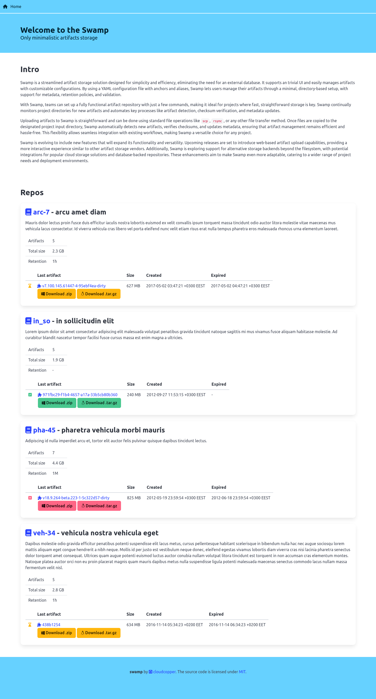
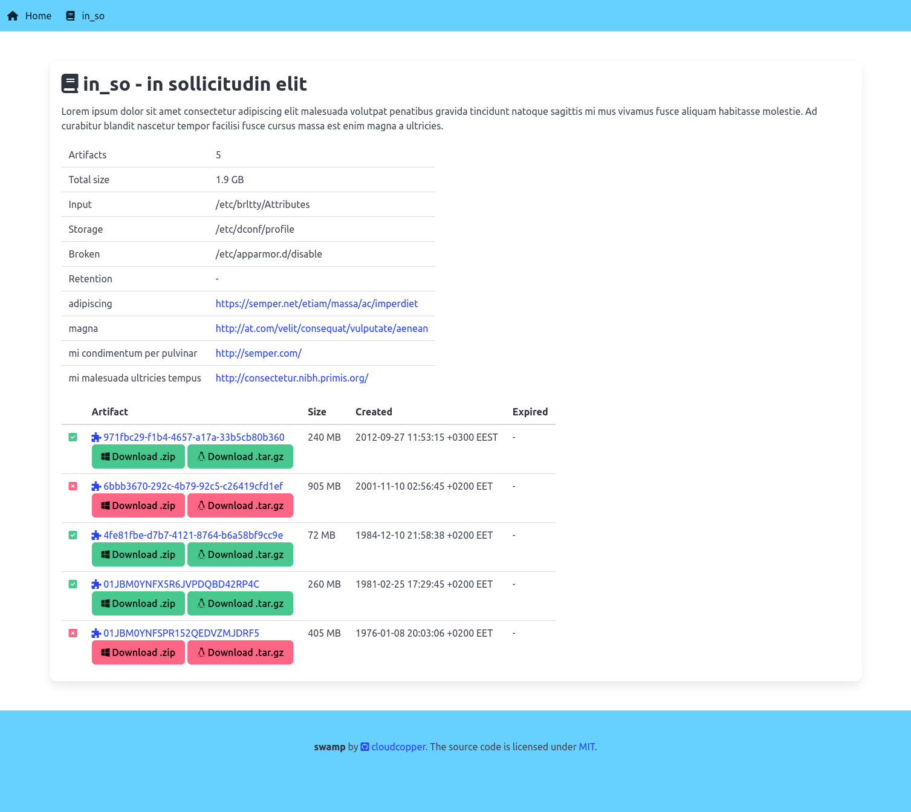
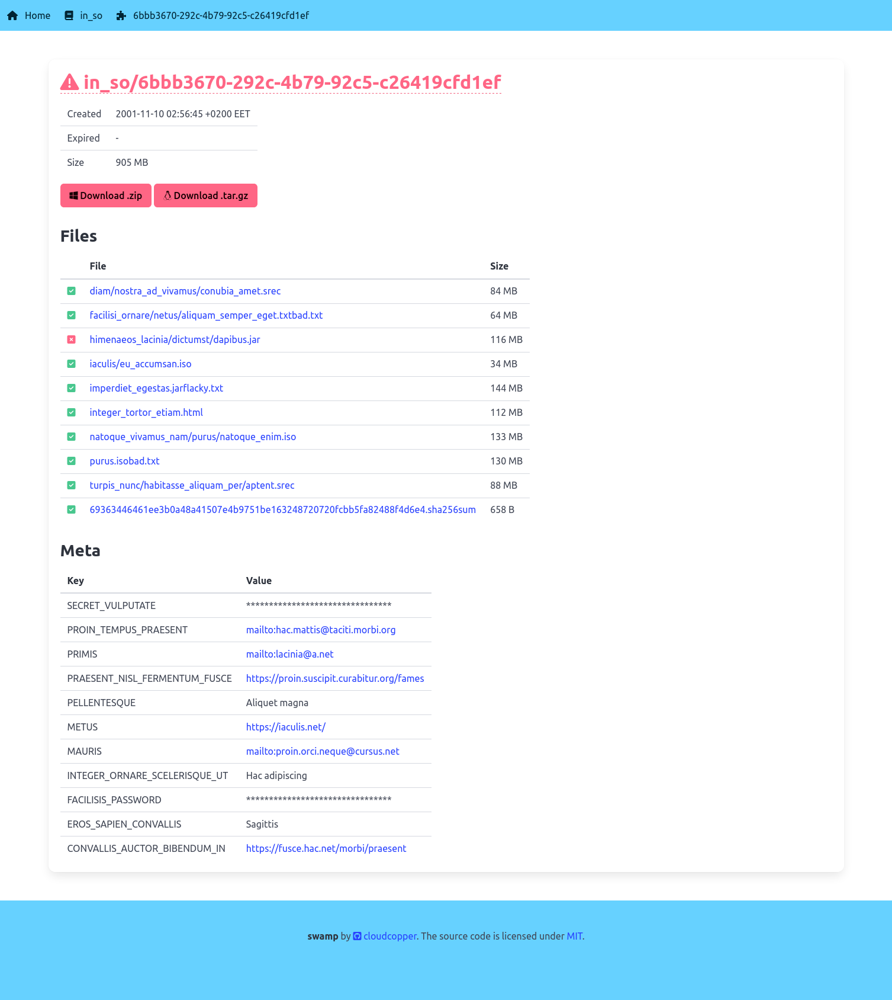

Swamp - Only minimalistic artifacts storage
===========================================
- No external database needed
- Simpliest UI
- Use of arbitrary directory as per project artifacts inputs
- Yaml config with anchors/aliases support (see [examples/six-repos/six-repos.yml](https://github.com/cloudcopper/swamp/blob/master/examples/six-repos/six-repos.yml))
- Artifacts retention
- Artifacts validation
- Artifacts metadata
- Repo metadata

Quick start
-----------

* Install swamp ```go install github.com/cloudcopper/swamp/cmd/swamp@latest``` or download from [Releases](https://github.com/cloudcopper/swamp/releases)
* Create config file ```swamp_repos.yml```:
    ```
    project-name:
        name:        "Project Name"
        description: "Project description text text text"
        input:       /home/user/tmp/project-name/
        storage:     /home/user/tmp/releases/project-name/"
        retention:   1h
    ```
* Run swamp ```swamp```
* Open webui at http://localhost:8080
* Create artifact:
    ```
    # Create artifact
    # ===============
    # have something to be inside artifact
    dd if=/dev/urandom bs=1k count=64 of=file1.bin
    dd if=/dev/urandom bs=1k count=64 of=file2.bin
    dd if=/dev/urandom bs=1k count=64 of=file3.bin
    # create optional metadata
    export > _export.txt
    # create optional _createdAt.txt
    date +%s > _createdAt.txt
    # create checksum of artifact files
    sha256sum file1.bin file2.bin file3.bin _export.txt _createdAt.txt > _checksum.txt

    # Deliver artifact
    # ================
    mkdir /home/user/tmp/project-name/artifact-id
    mv file1.bin file2.bin file3.bin _createdAt /home/user/tmp/project-name/artifact-id
    mv _checksum.txt /home/user/tmp/project-name/artifact-id/$(sha256sum _checksum.txt|cut -d' ' -f1).sha256sum)

    # Now the swamp would detect the new artifact with id 'artifact-id'
    # Check its checksum file
    # Move artifact to storage
    # And update data
    ```
* Refresh the http://localhost:8080

How swamp detects new artifacts
-------------------------------
It uses [fsnotify](https://github.com/fsnotify/fsnotify) to monitor the project's input directory
for new files. When a new *.sha256sum file is detected, and its name matches the checksum of its
contents, all files listed within are included as part of the artifact. The directory containing
the checksum file serves as the artifact ID.

Example:
* for project input: ```/tftproot/my_project/```
* and checksum file: ```/tftproot/my_project/rel3.0.0a/f843944c4c15009a3cdc39bf3dfc30c6adbc98bf5b3e056d429f04f1b4ad306b.sha256sum```
* the artifact id would be ```rel3.0.0a```

How to customize
----------------
See [CUSTOM](CUSTOM.md)

Current screenshots
-------------------




Design diagram
--------------


TODO
----
See [TODO](TODO.md)

